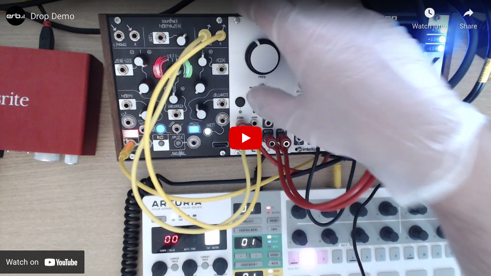

# Drop

`Drop` is a sample to illustrate a simple module, yet using quite some different eurorack blocks features.

It can generate builds to both run on VCV Rack and on the hardware Daisy platform, with the
same source code.

[](https://www.youtube.com/watch?v=uOmn_2ZmQoA)

## Overview

This module allows to make a typical "techno drop".

When active, the stereo input is either muted or goes through a high-pass filter. The latter cutoff frequency can be controlled with the `FREQ` pot, and can be used to selectively remove the drum kick frequencies.

When passive, it is just a bypass.

The transition from passive to active or active to passive is armed with the `ARM` button or gate. The actual transition only happens when the transition is armed and a `SYNC` trigger is received.

Typically, the `SYNC` gate input would be connected to a clock divider with appropriate reset, so that the `SYNC` is triggered only on beats or bars.


## Requirements

Make sure to first [set-up](https://github.com/ohmtech-rdi/eurorack-blocks/tree/main#setting-up)
your development environment.

> In the following sections, it is assumed that `python` is an alias to Python 3. If this is not the
> case on your platform, use `python3` instead. Alternatively, if your shell supports shebang,
> just run the script in your shell from its directory (_eg._ `./configure.py`)

### Quick Installation on macOS

Provided that [Homebrew](https://brew.sh) is already installed and up-to-date,
that Xcode is already installed as well,
then all dependencies can be installed by running:

```console
$ brew install armmbed/formulae/arm-none-eabi-gcc dfu-util ninja cairo libffi
$ pip3 install cairosvg cairocffi ezdxf soundfile numpy
```

The D-DIN Font must be installed on the system to render panel labels properly.
This font and its permissive SIL Open Font License
can be found [here in the repository](../../include/erb/vcvrack/design/d-din).

```console
$ cd eurorack-blocks/include/erb/vcvrack/design/d-din
$ cp *.otf ~/Library/Fonts
```


## Setting Up

```console
$ source eurorack-blocks/build-system/init.sh
```

This will add the `erbb` command line in your `PATH` for the current terminal.

You may want to add this line with the correct path to your `~/.profile` or `~/.bash_profile`,
to avoid to reload it each time.


## Configuring

```console
$ erbb configure
```

This will create an `artifacts` folder with everything needed to build for Daisy and VCV Rack.


## Building for VCV Rack

Open the generated project file into your IDE. Building will automatically copy the files to
the VCV Rack plug-in folder.


## Debugging on Xcode

To debug on Xcode, the following configuration must be first done:
- Select the `Product > Scheme > Drop` scheme,
- Go to `Product > Scheme > Edit Scheme...`,
- Select `Run` on the left column,
- In the `Info` tab:
   - Make sure the `Build Configuration` is `Debug`,
   - Choose VCV Rack as the `Executable`,
   - Select `Wait for executable to be launched` for Launch Option,
- In the `Options` tab:
   - Make sure the `Document Versions: Allow debugging... Versions Browser` is **unchecked**.

Now when running (`Product > Run`) the debugger will launch but will wait for VCV Rack to be
started manually.

> ⚠️ The implementation only supports the Daisy native sample rate, so make sure to set your audio
> output configuration to `48kHz` before testing!


## Building for Daisy

```console
$ erbb build
ninja: Entering directory `/Users/raf/dev/eurorack-blocks/samples/drop/artifacts/out/Release'
[10/10] LINK Drop
OBJCOPY Drop
...
```

This will create a binary file to upload to the Daisy seed. It is the `drop-daisy.bin` file
output in the `artifacts/out/Release` build directory.


## Deploying for Daisy

```console
$ erbb install dfu
Enter the system bootloader by holding the BOOT button down,
and then pressing, and releasing the RESET button.
Press Enter to continue...
Flashing...
dfu-util 0.9
[...]
Downloading to address = 0x08000000, size = 36484
Download   [=========================] 100%        36484 bytes
Download done.
File downloaded successfully
dfu-util: Error during download get_status
Run command exited with 74
```

Follow the onscreen instructions and this will download the `Drop.bin` firmware to the
Daisy Seed when it is connected to USB.

The error 74 reported from `dfu-util` can be safely ignored.

Alternatively, if `dfu-util` does not work properly on your computer,
one may use the [Daisy Web Programmer](https://electro-smith.github.io/Programmer/)
in the [Chrome](https://support.google.com/chrome/answer/95346) browser instead.
